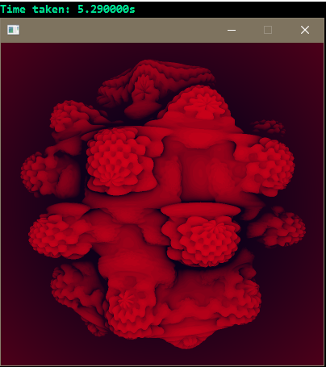
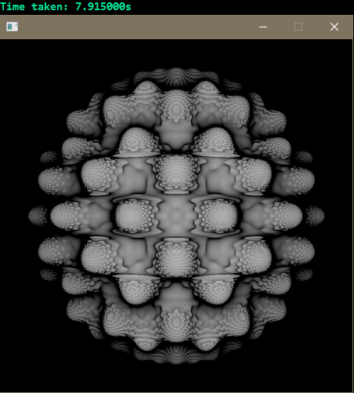
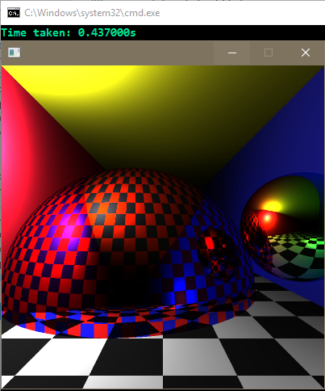
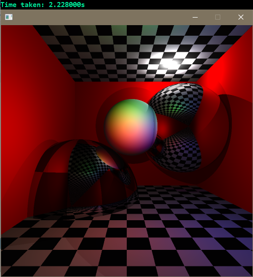

# pantaray
C++ Raytracer

# Usage
```cpp
#include "hpp/pantaray.hpp"
```

# Example code

```cpp

unsigned width = 400;
unsigned height = 400;

auto renderer = Renderer(width, height, Color(0.01f, 0.01f, 0.01f));
renderer.anti_aliasing = true;

auto camera = PinholeCamera(pi / 2.5f, float(width) / float(height))
    .Set(Vector(0, 0, 10), Vector(0, 1, 10));

auto plane_geometry = PlaneGeometry(Vector(0, 0, 0), Vector(0, 0, 1));
auto sphere_geometry = SphereGeometry(Vector(5, 20, 10), 6);

auto checker_texture = CheckerTexture(Color(0.8f, 0.8f, 0.8f), Color(0.1f, 0.1f, 0.1f));
auto normal_texture = NormalTexture();
auto lambert_shader = LambertShader();

auto point_light_left = PointLight(Vector(-15, 20, 30), 550);
auto point_light_right = PointLight(Vector(15, 2, 2), 150);
auto point_light_front = PointLight(Vector(0, 2, 2), 150);

auto scene = Scene()
    .Add(Mesh(plane_geometry, lambert_shader, checker_texture))
    .Add(Mesh(sphere_geometry, lambert_shader, normal_texture))

    .Add(point_light_front)
    .Add(point_light_right)
    .Add(point_light_left);

    
clock_t tStart = clock();

auto buffer = renderer.Render(camera, scene);

printf("Time taken: %.6fs\n", (double)(clock() - tStart) / CLOCKS_PER_SEC);

init(width, height, buffer); // SDL magic

return 0;

```

# Resources
 - [Ray tracing course](http://raytracing-bg.net)
 - [Mandelbulb](http://blog.hvidtfeldts.net)


# Screenshots

### Mandlbulb (ray marching with distance estimator)


### Mandlbulb 17th power


### Reflection with texturing


### Reflection and shadow


### Anti aliasing


### Console

